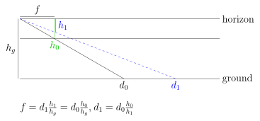

When the camera is perfectly level, the object's distance is $d_1 = d_0 \frac{h_0}{h_1}$.

When the camera is tilted downward with an angle $\theta$ (detected by sensors
like accelerometers and gyroscopes), the object's distance $d_1$ can be computed
as the following.

$$
\begin{align*}
  \xi &= d_0 \sin \theta \\
  f &= d_0 \cos \theta \\
  \lambda &= \xi / (h_0 - h / 2) \\
  \alpha_0 &= \theta + \tan^{-1} \left( \frac{\lambda h_0 - \xi}{f} \right) \\
  \alpha_1 &= \theta + \tan^{-1} \left( \frac{\lambda h_1 - \xi}{f} \right) \\
  d_1 &= d_0 \frac{tan \alpha_0}{tan \alpha_1}
\end{align*}
$$

where
- $h$ is the total image height in pixels,
- $\lambda$ is the ratio that maps pixel heights to lengths on the solid line
  that goes through $d_0$.
